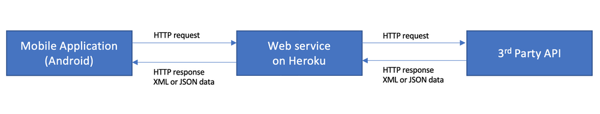
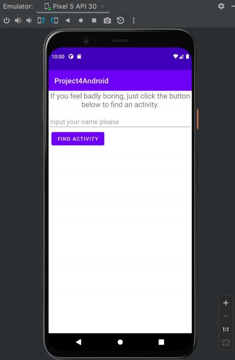
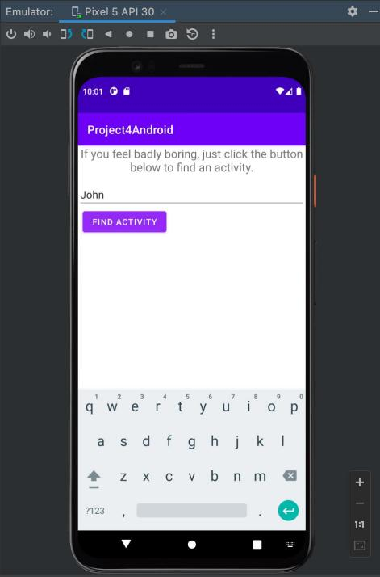
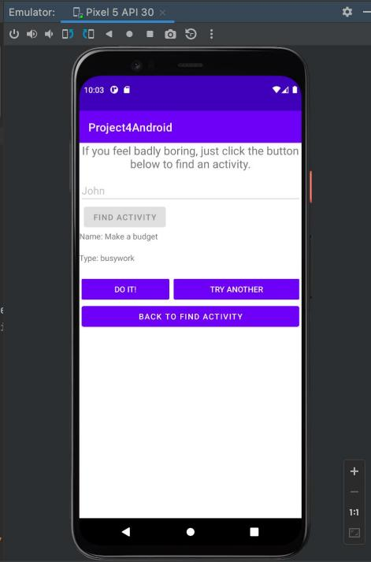
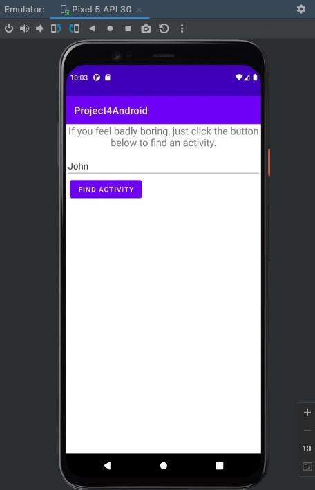
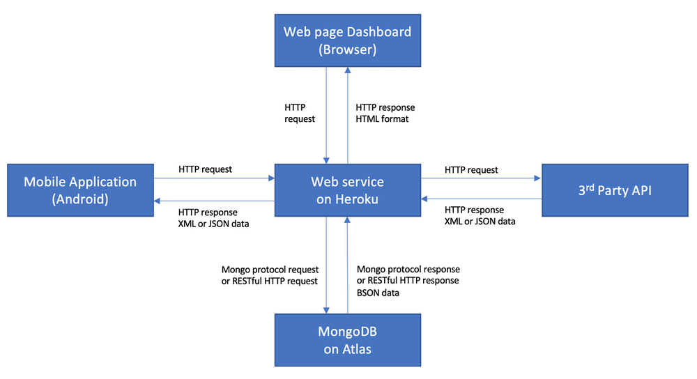
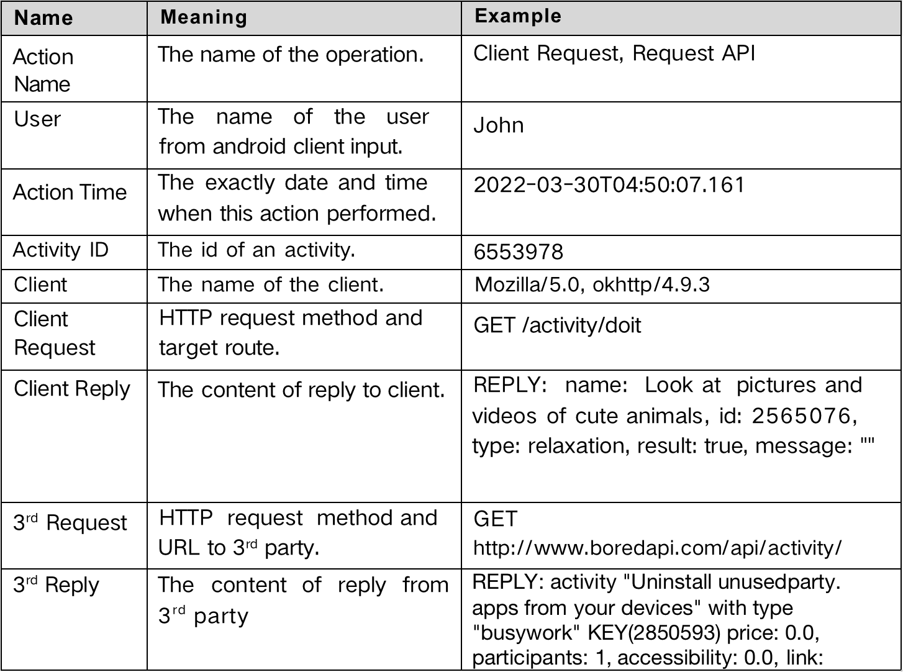
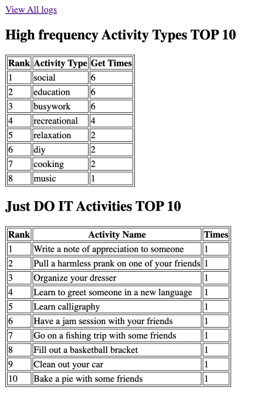
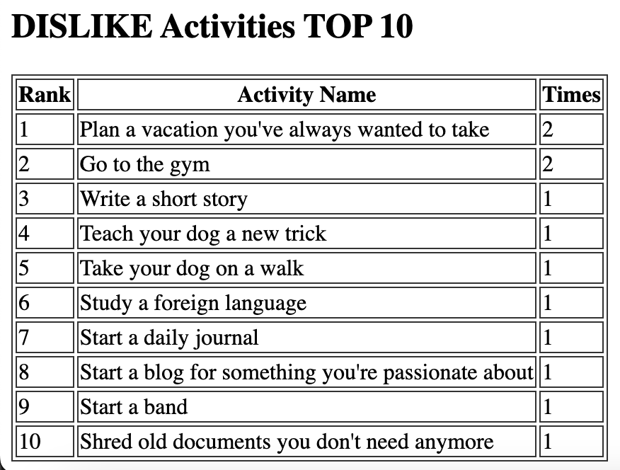
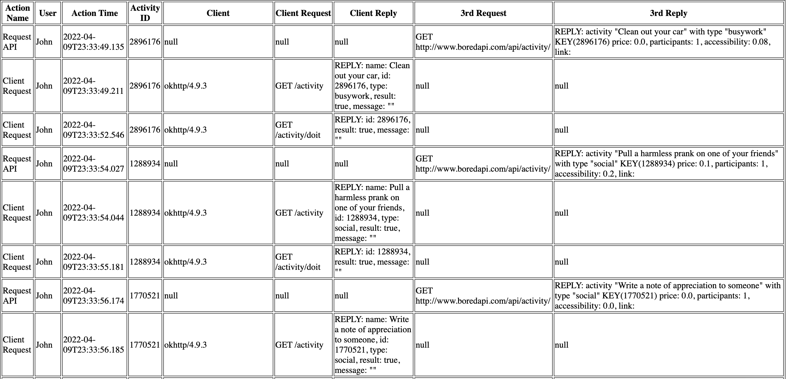

# Android Application

## Project Topics: Mobile to Cloud application

This project has 2 tasks:

- Task 1: design and build a simple mobile application that will communicate with a RESTful web service in the cloud.
- Task 2: add an operations logging and analysis function to your Task 1 web service.

## Task 1: Mobile to Cloud Application

Design and build a distributed application that works between a mobile phone and the cloud. 
Specifically, develop a native Android application that communicates with a web service that you deployed to Heroku.
The web service deployed to Heroku is a simple RESTful API.

The following is a diagram of the components in Task 1. 


My application takes a username string from the user, and to give user recommend activity by clicking "Find Activity" Button. 
User is able to choose "Do it" or "Try another activity" by clicking the corresponding button and also able to return to find activity just by clicking "Back to find activity" button.

## 1.  Implement a native Android application

The name of my native Android application project in Android Studio is: Project4Android

### 1.1  Has at least three different kinds of Views in My Layout

My Application uses TextView, EditText, Button views. 
See content_main.xml for details. 
Here is a screenshot of the layout before user has found any activity.



### 1.2  Requires input from the user

Here is a screenshot of user having input his/her name.



### 1.3  Makes  an  HTTP  request  (using  an  appropriate HTTP method) to your web service

My  application  does  an  HTTP  GET  request  in  GetActivity.java.  
The  http  request  is "https://frozen-castle-25997.herokuapp.com/activity/user=" + `userName`
(Where userName is the user inputted name).

### 1.4  Receives and parses an XML or JSON formatted
reply from your web service

An example of the JSON reply is:
```
{
    result: true,
    name: "Have a paper airplane contest with some friends",
    id: "8557562",
    type: "social",
    message: ""
}
```


### 1.5  Displays new information to the user

Here is a screenshot after user clicking "Find Activity" button.



The random activity type and name will show to the user. 
Then user can choose to do this activity by clicking "DO IT!" button or get another random activity by clicking "TRY ANOTHER" button.

### 1.6  Is repeatable (I.e. the user can repeatedly reuse the application without restarting it.)

User can just click the "BACK TO FIND ACTIVITY" button to go back to find activity.
Here is a screenshot of my application restore to default view and "Find Activity" button is enabled again. User can input another name now.




## 2.  Implement a web service, deployed to Heroku

The app name of my web service deployed to Heroku is: `frozen-castle-25997`
URL is:  https://frozen-castle-25997.herokuapp.com/
The project directory name is: `Project4Task1`

### 2.1  Implement a simple (can be a single path) API.

In my web app project:
Controller: `leow/project4task1/ActivityProvider.java`
Route:
```
/activity for getting a random activity
/activity/doit client action do this activity
/activity/dislike client action dislike this activity
```


### 2.2  Receives an HTTP request from the native Android
application

`/activity` receives an HTTP GET request with parameter user and passes the user to the controller.
`/activity/doit` receives an HTTP GET request with 2 parameters: user and id, user is user name from android client, id is an id of an activity. 
They are both been passing to the controller.
`/activity/dislike` is the same as `/activity/doit`.

### 2.3  Executes   business   logic   appropriate   to   your
application.  This   includes  fetching  XML   or  JSON information from some 3rd party API and processing the response.
ActivityProvider.java makes an HTTP GET request to 3rd  party boredapi which URL is “ http://www.boredapi.com/api/activity/”.
It will reply a JSON formatted random activity information to my web application. An example of the JSON:
```
{
    activity: "Plan a vacation you've always wanted to take",
    type: "relaxation",
    participants: 1,
    price: 0,
    link: "",
    key: "7265395",
    accessibility: 0.05
}
```
`ActivityProvider.java` will package the useful information to android client.

### 2.4  Replies to the Android application with an XML or JSON formatted response. The schema of the response can be of your own design.
`makeJSONResponse` method in ActivityProvider.java will make a JSON response which
schema of my own design is:

```
{
    result: <a boolean value true or false>,
    name: <a string value>,
    id: <a string value>,
    type: <a string value>,
    message: <a string value>
}
```

In android client, I use the boolean value result to check whether the request succeeded or not. And message is used to show error message while result is false.

Name is the name of an activity.
Id is the key code of an activity.
Type is the type of an activity.

## Task 2: Web Service Logging and Analysis Dashboard

For Task 2, you are to embellish your web service to add logging, analysis, and reporting capabilities. In other words, you are to create a web-based dashboard to your web service that will display information about how your service is being used. This will be web-page interface designed for laptop or desktop browser, not for mobile. In order to display logging and analytical data, you will have to first store it somewhere.  For this task, you are required to store your data in a NoSQL database, or more specifically a MongoDB, database hosted in the cloud.

The following is a diagram of the components in Task 2.



My application takes a username string from the user, and to give user recommend activity by clicking "Find Activity" Button. User is able to choose "Do it" or "Try another activity" by clicking the corresponding button and also able to return to find activity just by clicking “Back to find activity" button.
And my web application will record all operations from clients. Those records will be processed by analysis functions. User will first see three tables of analysis, they are "High frequency Activity Types TOP 10", "Just DO IT Activities TOP 10" and "DISLIKE Activities TOP 10".
The dashboard URL is: https://frozen-castle-25997.herokuapp.com/
Or https://frozen-castle-25997.herokuapp.com/index.jsp

## 1. Log useful information




## 2. Store the log information in a database
   I use InfoStore class to implement all operations with mongodb in InfoStore.java class Module.
   I use POJO classes to store and retrieve data from mongodb.
   I created to POJO classes: BoringActivity and ActivityLog.
   Reference link: https://www.mongodb.com/docs/drivers/java/sync/v4.3/quick-start/
   Both these two classes have empty constructor methods that will ensure mongodb lib being able to create POJOs.
   Then all operations with mongodb will be easier and better understanding.
   An example of POJO class:
   ```
   public class BoringActivity {
   private String activityName;
   private String activityType;
   private String activityId;
   public String getActivityName() { return activityName; }
   public void setActivityName(String value) { activityName = value; }
   public String getActivityType() { return activityType; }
   public void setActivityType(String value) { activityType = value; }
   public String getActivityId() { return activityId; }
   public void setActivityId(String value) { activityId = value; }
   public BoringActivity() { }
   }
   ```
   An example of inserting to collections:
   ```
   // get infos collection 
   MongoCollection<ActivityLog> collection = db.getCollection("infos", ActivityLog.class); 
   // insert log record 
   collection.insertOne(_info);
   ```


## 3. Display operations analytics and full logs on a web-based dashboard
   Here is a screenshot of how they being displayed to user:
   
   
   


### 3.1 A unique URL addresses a web interface dashboard for the web service.

The unique URL address is: https://frozen-castle-25997.herokuapp.com/index.jsp


### 3.2 The dashboard displays at least 3 interesting operations analytics.

"High frequency Activity Types TOP 10", "Just DO IT Activities TOP 10" and "DISLIKE Activities TOP 10" are my 3 interesting operations analytics.

High frequency Activity Types TOP 10:Among those random activities I grouped them by the types of activities. And counted the getting times of type of activity. Sorted by getting times by descending order.
Just DO IT Activities TOP 10: The top 10 activities user clicked "DO IT!" button to. 
DISLIKE Activities TOP 10: The top 10 activities user clicked "TRY ANOTHER" button to.


### 3.3 The dashboard displays formatted full logs.

Considering a mess of things will show in dashboard page, I moved full logs to another url which is https://frozen-castle-25997.herokuapp.com/logs.jsp and there also a link in dashboard page.
```
<a href=”logs.jsp”>View Full Logs</a>
The formatted full logs table was implemented by tags in jsp looping:
<% for (ActivityLog log : logs) { %>
<tr>
<td><%=log.getActionName()%></td>
<td><%=log.getUserName()%></td>
<td><%=log.getActionTime()%></td>
<td><%=log.getActivityId()%></td>
<td><%=log.getClientInfo()%></td>
<td><%=log.getClientRequestInfo()%></td>
<td><%=log.getClientReplyInfo()%></td>
<td><%=log.getApiRequestInfo()%></td>
<td><%=log.getApiReplyInfo()%></td>
</tr>
<% } %>
```
Here is a screenshot of full logs page:



## 4. Deploy the web service to Heroku
   I used a tomcat docker image to deploy to Heroku.
   `ROOT.war` package and `tomcat_starter.sh` script are built into this image.
   After my docker image being pushed to Heroku web application `frozen-castle-25997`. 
   My web service is available at: https://frozen-castle-25997.herokuapp.com/
